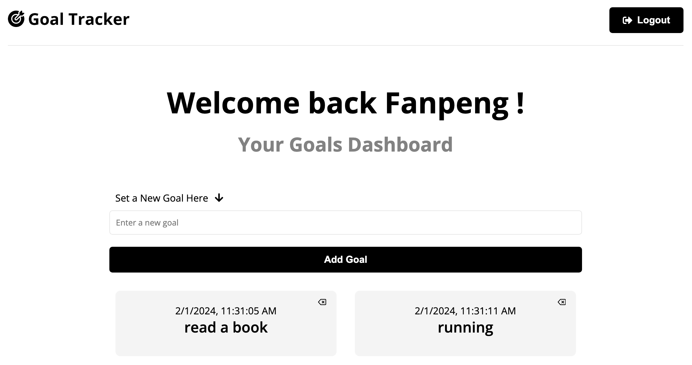

# 🏆 Goal Tracker App

## Table of Contents

1. [Features](#features)
2. [Installation](#installation)
3. [Demo](#demo)
4. [License](#license)

## Features

This is a full-stack MERN (MongoDB, Express.js, React.js, Node.js) project that keep track of your goals.

User Authentication: Register with an email and password, and securely log in to your dashboard.

### Frontend:

- Frontend state is handled with React, Redux.

### Backend:

- Node.js, Express.js: build the backend server.
- RESTful API: use for CRUD feature (create, read, update, and delete goals on the goal dashboard).
- MongoDB Database: store user information and goal data.
- JWT Authentication: user authentication and authorization.

## Installation

Clone the repository to your local machine:

```bash
git clone git @github.com:Fanpeng-L/goal-tracker-MERNfullstack.git
```

Navigate to the project directory and install dependencies:

```bash
cd goal-tracker-MERNfullstack
npm install
```

Configuration
In the server directory, create a .env file:

```bash
touch .env
```

Inside the .env file, add the following environment variables:

```plaintext
PORT = 5000
MONGO_URI = XXXXXXXXXXXXXXXXXXXXXXXX/
JWT_SECRET = abc123
```

Replace your_mongodb_connection_string with the connection string for your MongoDB database.

Replace your_jwt_secret with a secret key for JWT token generation.

Running the App:

```bash
npm start
```

Open your browser and navigate to http://localhost:5000 to view the app.

## Demo

Preview:



## License

This project is licensed under the MIT License.
